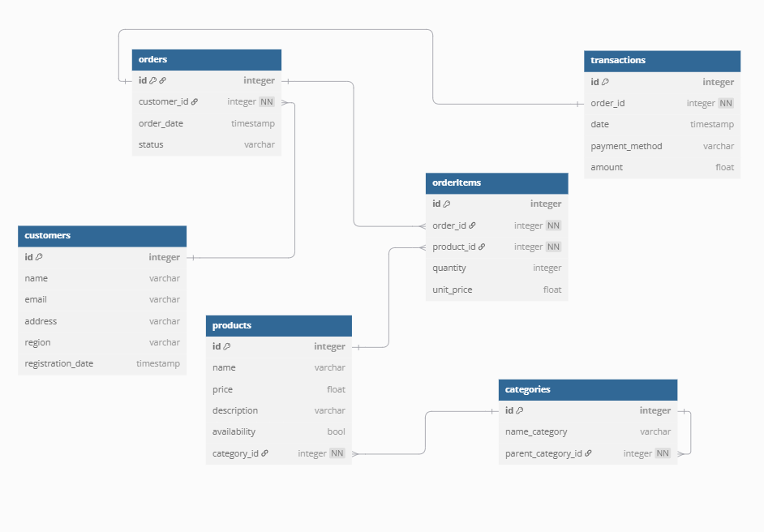
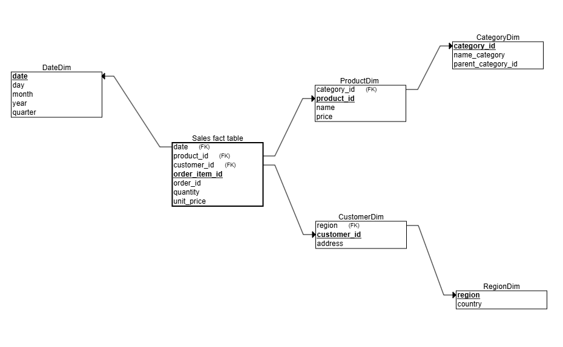

## E-commerce Data Model

### 1. Navrhnite dátový model vo forme ER diagramu (Entity-Relationship diagram), ktorý pokryje nasledovné požiadavky:

  
*Diagram znázorňuje relačný model databázy pre e-commerce aplikáciu.*

---

### 2. Definujte dimenzie a faktové tabuľky pre analytické potreby:

  
*Analytický model vo forme snowflake schémy s dimenziami a faktovou tabuľkou.*

---

### 3. Identifikujte:

#### 3.1. Primárne a cudzie kľúče:

- **Products**: `id` (PK), `category_id` (FK)
- **Categories**: `id` (PK), `parent_category_id` (FK)
- **Customers**: `id` (PK)
- **Orders**: `id` (PK), `customer_id` (FK)
- **OrderItems**: `id` (PK), `order_id` (FK), `product_id` (FK)
- **Transactions**: `id` (PK), `order_id` (FK)

#### 3.2. Možné normalizačné kroky a úrovne normalizácie:

Dátový model pre OLTP časť bol navrhnutý podľa zásad 3. normálnej formy (3NF):

- **1NF (Prvá normálna forma):**
  - Každý stĺpec obsahuje len atómové (nedeliteľné) hodnoty.
  - V tabuľkách nie sú opakujúce sa skupiny ani zoznamy.

- **2NF (Druhá normálna forma):**
  - Všetky ne-kľúčové atribúty sú plne závislé od celého primárneho kľúča.

- **3NF (Tretia normálna forma):**
  - Neexistujú tranzitívne závislosti medzi ne-kľúčovými atribútmi.

Takto navrhnutý model zabezpečuje minimálnu redundanciu, konzistenciu údajov a jednoduchú údržbu dát.

#### 3.3. Miesta, kde by denormalizácia mohla zvýšiť výkonnosť analytických dotazov:

- **Zlúčenie `ProductDim` a `CategoryDim`:**
  - Umožní analyzovať predaje podľa kategórie bez ďalšieho JOIN-u.

- **Zlúčenie `CustomerDim` a `RegionDim`:**
  - Umožní rýchlejšie agregácie podľa regiónu.

- **Pridanie opisných polí do faktovej tabuľky:**
  - Napr. `product_name`, `customer_region`, ak sa často používajú vo filtroch.

---

### 4. SQL schéma na vytvorenie tabuliek:

```sql
DROP TABLE IF EXISTS "transactions" CASCADE;
DROP TABLE IF EXISTS "orderItems" CASCADE;
DROP TABLE IF EXISTS "orders" CASCADE;
DROP TABLE IF EXISTS "products" CASCADE;
DROP TABLE IF EXISTS "customers" CASCADE;
DROP TABLE IF EXISTS "categories" CASCADE;

CREATE TABLE "products" (
    "id" integer PRIMARY KEY,
    "name" varchar(255),
    "price" float,
    "description" varchar(255),
    "availability" bool,
    "category_id" integer NOT NULL
);

CREATE TABLE "categories" (
  "id" integer PRIMARY KEY,
  "name_category" varchar(255),
  "parent_category_id" integer NULL
);

CREATE TABLE "customers" (
 "id" integer PRIMARY KEY,
 "name" varchar(255),
 "email" varchar(255),
 "address" varchar(255),
 "region" varchar(255),
 "registration_date" timestamp
);

CREATE TABLE "orders" (
  "id" integer PRIMARY KEY,
  "customer_id" integer NOT NULL,
  "order_date" timestamp,
  "status" varchar(100)
);

CREATE TABLE "orderItems" (
  "id" integer PRIMARY KEY,
  "order_id" integer NOT NULL,
  "product_id" integer NOT NULL,
  "quantity" integer,
  "unit_price" float
);

CREATE TABLE "transactions" (
    "id" integer PRIMARY KEY,
    "order_id" integer NOT NULL,
    "date" timestamp,
    "payment_method" varchar(100),
    "amount" float
);

ALTER TABLE "products" ADD FOREIGN KEY ("category_id") REFERENCES "categories" ("id");
ALTER TABLE "orders" ADD FOREIGN KEY ("customer_id") REFERENCES "customers" ("id");
ALTER TABLE "orderItems" ADD FOREIGN KEY ("order_id") REFERENCES "orders" ("id");
ALTER TABLE "orderItems" ADD FOREIGN KEY ("product_id") REFERENCES "products" ("id");
ALTER TABLE "transactions" ADD FOREIGN KEY ("order_id") REFERENCES "orders" ("id");
ALTER TABLE "categories" ADD FOREIGN KEY ("parent_category_id") REFERENCES "categories" ("id");
```

---

### 5. Diskusia

#### Aké kompromisy by ste spravili medzi normalizáciou a výkonnosťou?
